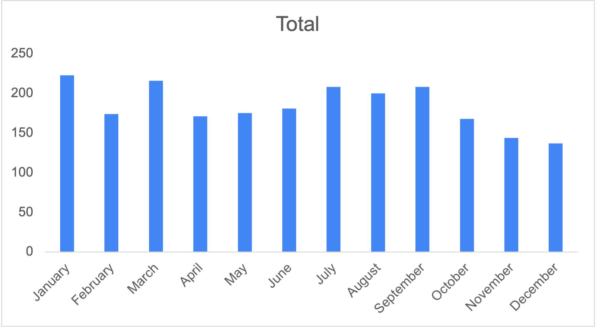
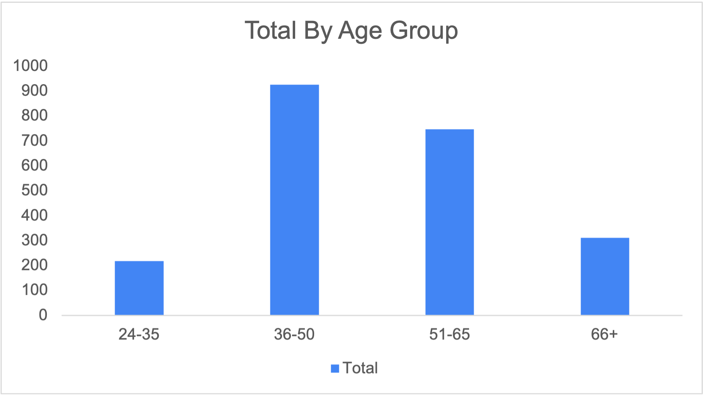

# Excel Project

### Analyzing iFood Sales Throughout the Year 
I’ve made food delivery services a partial routine to explore and sample new cuisines. Being a food enthusiast, I really enjoy experimenting with diverse foods, ranging from renowned fast-food chains to the amazing local eateries around the corners of my neighborhood. Since the inception of food delivery apps, they have witnessed consistent expansion. This led me to ponder whether this growth is mirrored in other countries as well. What is the annual sales figure for a typical food delivery app? Which demographic groups are typically making purchases? 

I employed Excel to uncover a dataset pertaining to iFood, a Brazilian food delivery application. This dataset offered remarkable insights that helped address a variety of questions.  
- $1.24 Million was spent on iFood in 2018 
- 183 customers per month was the monthly average 
- 67% of spending variance can be explained by the customer’s income level

#### Starting With the Data 
The dataset serves as an interview case study for a data analyst position. You can find the dataset here. 

The important columns are: 
- Income: A customer’s yearly income 
- MntTotal: Total amount spent by customer 
- Kidhome: Number of kids in the home 
- Teenhome: Number of teens in the home 
- Recency: Number of days since the last purchase 
- MntWines: Amount spent on wine  
- MntFruits: Amount spent on fruits 
- MntMeatProducts: Amount spend on meat products 
- MntFishProducts: Amount spent on fish products 
- MntSweetProducts: Amount spent on sweet products 
- Age: Age of the customer 
- AcceptedCmp6: Whether customer accepted offer during campaign 6 
- Customer_Days: Number of days the customer has been a customer for iFood 
- DateJoined: The date the customer joined iFood

To facilitate analysis, the following columns were introduced: 
- PctIncome: Percentage of income spent by the customer 
- Month Joined: Formula used - =MONTH(AM2)
- AgeGroup: Formula used -
  =IF(AND(Z2 < 36, Z2>23), "24-35",\
                            IF(AND(Z2 < 51, Z2>35), "36-50",\
                            IF(AND(Z2 < 66, Z2>50), "51-65",\
                            IF(Z2>65, "66+", "?"))))

#### Analysis
The first correlation I wanted to see was the Income vs Total Spent.  

The chart reveals a distinct correlation, indicating that higher spending tends to be associated with higher income. This is where I found the customer's income level can account for 67% of the variance in spending. Of course, what’s a chart without some outliers? The most prominent outliers existed at both extremes of the spectrum: one individual with very low income exhibited high spending, while another with significantly higher income displayed minimal expenditure. 

Next, I looked into the number of customers that joined each month, where the average per month was 183. 

There was a good number of customers joining each month and I wanted to see totals by age group. 

It was surprising to see that the youngest age group, 24-35, had the smallest customer count. While there's a common perception that younger individuals spend more on these food delivery apps, it's noteworthy that most customers fall within the 36-50 age group. 

#### Conclusion

The correlation between income and spending is indeed logical. We commonly associate takeout with a form of indulgence, and consequently, food delivery options often fall within that same category.  

This dataset has certainly provided me with fresh insights into the purchasing patterns across different age groups. Numerous factors may contribute as to why specific age groups make more purchases than others. There might be opportunities for new marketing strategies to boost the number of purchases within specific age groups, particularly among those aged 24-35.  
